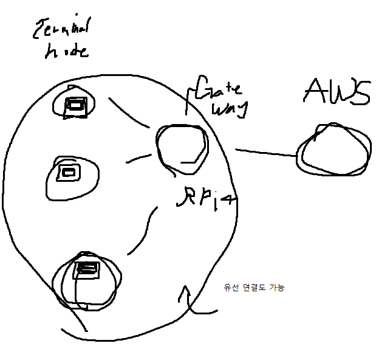

시리얼 모니터 결과 확인 - >
ctrl + shift + M

<details>
<summary>교수님, 혹시 PWM 제어에서 LED 채널이 무엇인지 궁금합니다
</summary>

박노진 강사[서울_21반]
오후 3:44
channel 당 하나의 제품을 제어한다고 보시면 됩니다.

마치 cpu 코어 개수 같은 개념이라


김동현[서울_21반]
오후 3:45
0 1 2 순서대로 임의로 부여해서 사용하면 되는 것인가요?


박노진 강사[서울_21반]
오후 3:45
channel 이 몇 개 지원하냐에 따라 몇 개의 PWM 제어를 별도로 제어할 수 있는가 를 나타냅니다

넵 0부터 채워 넣는 게 낫겠죠


김동현[서울_21반]
오후 3:46
혹시 몇번까지 있는지는

어떻게 알 수 있나요?


박노진 강사[서울_21반]
오후 3:46
https://www.upesy.com/blogs/tutorials/esp32-pinout-reference-gpio-pins-ultimate-guide

새로운 메시지
여기에는 18개까지 지원이 된다고 나와있습니다


김동현[서울_21반]
오후 3:47
답변 감사합니다!
</details>

16:17

[아두이노 DOC](https://www.arduino.cc/reference/ko/)

map 함수, constrain 함수가 굉장히 유용하여 알아두는 것이 좋습니다

<hr>
## ESP 32
웹 서버로서 동작이 가능합니다

주의사항!
built in led 를 사용하더라도 
pin Mode로 설정해주어야 동작합니다!
```ino
void setup(){
    pinMode(LED_BUILTIN, OUTPUT);
}

void loop(){
    digitalWrite(LED_BUILTIN,HIGH);
}
```

<hr>

엣지 컴퓨팅 기술이란?
말단에 있는 장비가 통신이 끊겨도 작동을 유지하다가 
통신이 재개되면 서버로 데이터를 전송

edge node라는 중간 노드가 존재합니다.

용어 정리
SoC
NPU
포그 컴퓨팅

앞으로의 수업 목표
