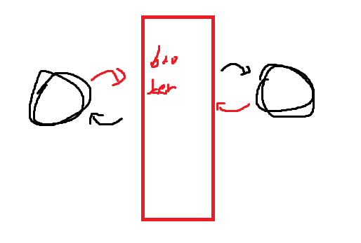
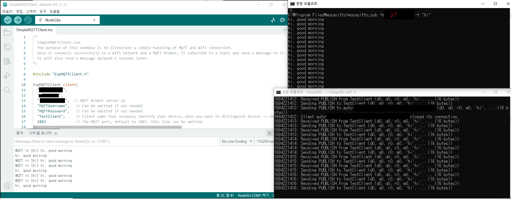

MQTT 임베디드 IoT에서 반드시 알아야 합니다

## MQTT
신뢰성 있는 데이터 전송 및 원격제어를 위해 만들어진 프로토콜입니다.(ISO 표준)

열악한 네트워크 환경에서 센서와 엑츄에이터 등을 달고 있는 소형 기기들의 데이터 전송 및 원격제어를 위해서 사용하는 국제 표준 프로토콜

저전력

성능도 매우 부실하기에 장치가 간신히 돌아갈 수 있는 정도

Broker를 통해서만 통신이 가능하다는 중요한 특징이 있습니다.

publish -> 전송
subscribe -> 수신

구독자와 발행자는 정해진 것이 아니라 상황에 따라 바뀔 수도 있습니다.
