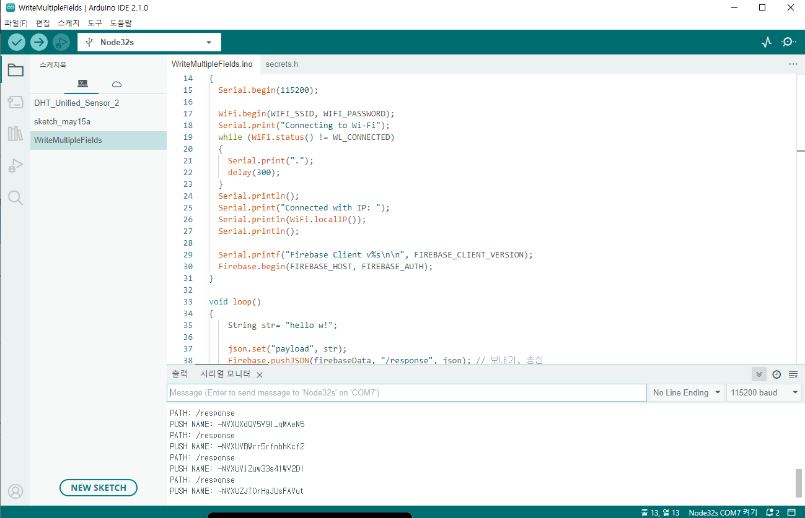
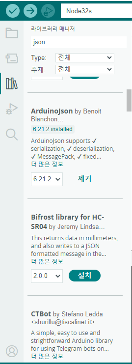

2022 IoT & Edge Developer Survey Report
요약
CPU, 메모리, 페리페럴 중 제일 고성능?
1. ESP 32
2. rpi4
3. 르네사스
4. STM
->2번이 제일 고성능, 하지만 하드디스크가 없기 때문에 데이터를 sd카드에 저장

JAVA, C, CPP가 가장 성호되며 자바는 특히 IoT gateway와 edge node에서 선호됩니다

산업용 IOT, IIOT에서 가장 선호되는 MQTT 프로토콜

64비트 ARM architecture는 gateway와 edge node에서 계속 확장중
    ARM architecture의 최대 장점 - 저전력

    엣지 컴퓨팅 : 데이터가 중앙 서버에서 처리되지 아니하고, 
    디바이스 노드, 터미널에 해당하는 장치에서 데이터를 처리하는 기술

    자율주행 자동차: 카메라로 인식을 하고 즉각적인 반응, 브레이크 동작

구글은 Middleware market에서 손을 떼기로 결정하였습니다
AWS IoT 32% MS IoT 22% GCP IoT 17%

firebase 는 nosql
ino에 json 관련 함수가 있지 않을까 생각하여 검색
->

